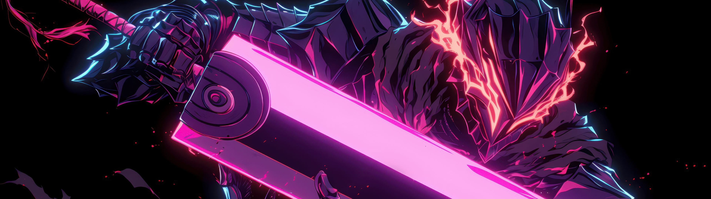

  
  
  <h1>Hi 👋, I'm Shantanu</h1>
  <h3>Machine Learning Engineer | Computer Vision | Deep Learning | Gen AI</h3>

---

## 📊 GitHub Stats:

  
  
  
  
  

  

---

### 🛠️ Languages and Tools:

  
  
  
  
  
  
  
  
  
  
  
  
  
  
  
  

---

<h3 align="left"> Connect with me:</h3>

  
  

